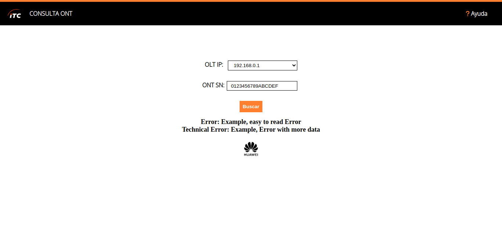
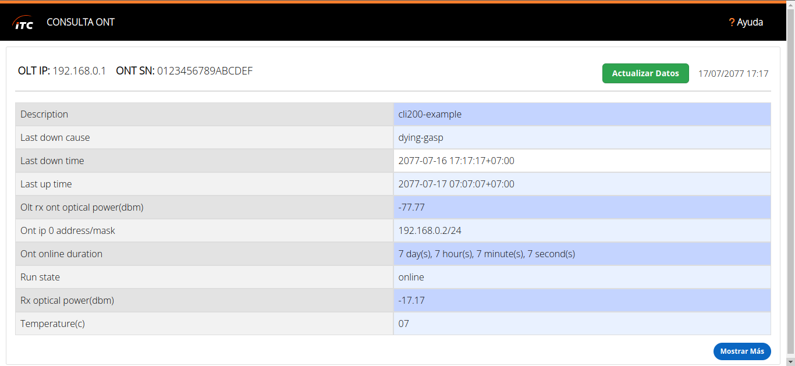

# Optical Network Terminal Information

## Obtains and displays useful information about the status and operation of a specific ONT

This project consists of a web application that is responsible for retrieving data from the requested ONT through an SSH connection to the OLT that makes the request. Then, save that query in the database so that the next time a new similar one is made within a certain time range, the website will use the already created query to be displayed.

The goal is to automate the process of searching and obtaining all relevant information from a customer's ONT.


*A simple diagram showing the entire process of collecting and displaying the ONT information.*

## 📟 Supported OLT Models

- [X] [Huawei SmartAX MA5800-X2](https://support.huawei.com/enterprise/en/optical-access/smartax-ma5800-pid-21484577)

## 💡 Technologies Used

### Backend

- **Flask**: A micro web framework for Python used to create the web application.
- **Python**: The primary programming language for server-side logic and data processing.

### Database

- **MongoDB**: A NoSQL database used to store and manage data for the application.

### Frontend

- **HTML**: Used for creating the structure and content of web pages.
- **CSS**: Used for styling the web pages to improve the user interface.
- **JavaScript**: Implemented for enhancing interactivity and functionality on the client-side.

### Additional Tools and Libraries

- **[pexpect](https://pexpect.readthedocs.io/en/stable/)**: Used for automating interactions with command-line applications.

## 🛠️ Installation

The installation is divided for [Windows](#windows-installation) and [Linux](#linux-installation) systems.   
Although Windows is supported, it is recommended to use Linux for better performance.

### Linux Installation

The quickest way to configure everything is by running the following command:

```shell
git clone https://github.com/MauroGuar/ONT-Info.git && cd ONT-Info && sudo sh run.sh
```

**This command does the following:**

1. Clones the repository

    ```bash
    git clone https://github.com/MauroGuar/ONT-Info.git
    ```
2. Enters to the project folder
    ```bash
    cd ONT-Info
    ```
3. Runs the installation script (run.sh)
    ```bash
    sudo sh run.sh
    ```
This will create the "flask-app" and "mongo" services with all dependencies installed and configured.
    
### Windows Installation

To perform a correct installation in Windows, follow the following steps:

1. Clone the repository
    ```bash
    git clone https://github.com/MauroGuar/ONT-Info.git
    ```

2. Enter to the project folder

3. Go to the "app" folder

4. Copy the file ".env.example" and rename it ".env"

5. Edit the .env file and put your credentials in "OLT_USERNAME", "OLT_PASSWORD" and "FLASK_SESSION_SECRET_KEY"

6. If you do not have docker installed, [download docker desktop for windows](https://docs.docker.com/desktop/install/windows-install/)

7. From a terminal, in the main directory, run the command
    ```bash
    docker compose up -d
    ```

8. Docker compose will run in detached mode

This will create the "flask-app" and "mongo" services with all dependencies installed and configured.

### Installation Tips (Both Operative Systems)

Here are some important tips to keep in mind when performing the installation:

1. If your OLT's IP is in the range of Docker's internal network, 172.16.0.1 to 172.31.255.254, then you will need to configure a static route for your OLT's network to use your network interface gateway.
    - You can do this on Linux with the `iproute2` package, by running the following command:
    ```bash
    sudo ip route add {YOUR OLT IP} via {YOUR GATEWAY IP} 
    ```
## Customizing

If you want to change data of the project for your specific case, read the [customizing guide](docs/customizing.md)

## 🖼️ Showcase

### Index Page



### Result Page



## 🌱 Contributing

If you want to collaborate with the project to add features or fix some bugs, read the [contributing guide](docs/contributing.md).  
The repository owner is David Portales, so he is the one in charge of everything related to contributions.

